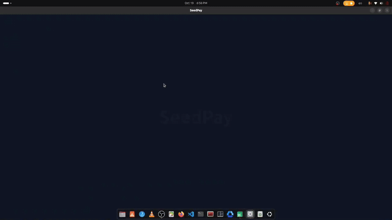

# 💳 SeedPay — Digital Wallet (Qt & C++)



**SeedPay** is a modern desktop wallet application built with **C++ and Qt (QML)**.
It’s an upgraded and fully graphical version of the original console-based SeedPay wallet, featuring a responsive UI, real-time transaction management, and smooth animations.

---

## 🎥 Demo Video

Watch the demo video to see **SeedPay** in action:  
👉 [🔗 Click here to view the demo](https://drive.google.com/file/d/1tDL4L5k3g1A1GWs3a0eVybnmU9UFSWgp/view?usp=drive_link)  

---

## 🚀 Features

* **User Authentication**

  * Secure registration and login system
* **Dashboard Overview**

  * Displays current user and wallet balance in real-time
* **Transaction Management**

  * Deposit, withdraw, pay bills, and send money to other users
* **Interactive UI**

  * Built using Qt Quick Controls 6 with smooth transitions
* **Detailed Transaction History**

  * Click on any transaction to view full structured details
* **Modern Dialogs**

  * Custom dialogs for bills, amounts, and balance display
* **Persistent Data Storage**

  * Transaction and user data stored using repository pattern

---

## 🧩 Architecture Overview

SeedPay follows a **modular architecture** separating logic and interface:

| Layer                 | Description                                                               |
| --------------------- | ------------------------------------------------------------------------- |
| **Frontend (QML)**    | Modern UI using `QtQuick`, `QtQuick.Controls`, and animations             |
| **Bridge Layer**      | `AppBridge` class connects UI actions with backend logic                  |
| **Business Logic**    | `TransactionService`, `UserRepository`, and models handle data operations |
| **Persistence Layer** | File-based repositories manage local user and transaction data            |

---

## 🖼️ UI Overview

* **Splash Screen** — Intro animation with logo and credit text
* **Login / Register Pages** — Simple user authentication
* **Dashboard** — Core of the app; includes:

  * User info and balance card
  * Action grid: Deposit, Withdraw, Pay Bill, Send Money, View Balance, Refresh
  * Transaction history list with clickable details
  * Logout and Quit buttons

---

## 🧠 Key Technologies

* **Language:** C++17
* **Framework:** Qt 6.5 (QML / Quick Controls)
* **Build System:** CMake
* **UI:** QML + QtQuick Controls
* **Data Storage:** File-based repositories

---

## 📂 Project Structure

```
seedpayqml/
│
├── CMakeLists.txt
├── main.cpp
├── resources.qrc
│
├── qml/
│   ├── Main.qml
│   ├── SplashScreen.qml
│   ├── LoginPage.qml
│   ├── RegisterPage.qml
│   ├── DashboardPage.qml
│   └── images/
│       └── wallet.png
│
├── AppBridge.h / AppBridge.cpp
├── TransactionService.h / TransactionService.cpp
├── TransactionRepository.h / .cpp
├── UserRepository.h / .cpp
└── other core model files...
```

---

## ⚙️ Build Instructions

### 🧾 Prerequisites

* Qt 6.5 or later
* CMake 3.16+
* A C++17 compatible compiler

### 🔧 Build Steps

```bash
# Clone the repository
git clone https://github.com/ma7moud111/SeedPay.git
cd SeedPay

# Create build directory
mkdir build && cd build

# Configure the project
cmake .. -DCMAKE_PREFIX_PATH=$(qtpaths --install-prefix)

# Build
make -j$(nproc)

# Run
./appseedpayqml
```

---

## 📦 Resource Setup

Ensure `resources.qrc` includes:

```xml
<RCC>
  <qresource prefix="/qml">
    <file>Main.qml</file>
    <file>SplashScreen.qml</file>
    <file>LoginPage.qml</file>
    <file>RegisterPage.qml</file>
    <file>DashboardPage.qml</file>
    <file>images/wallet.png</file>
  </qresource>
</RCC>
```

---

## 🧑🏽‍💻 Author

**Mahmoud Sayed**
💼 Embedded Linux Engineer
🔗 [LinkedIn](https://www.linkedin.com/in/mahmoud-sayed-782857274/)

---

## 🏁 Future Improvements

* Add database-based persistence (SQLite)
* Implement multi-currency support
* Add API layer for online wallet synchronization
* Introduce charts and analytics for spending overview

---

## 📝 License

This project is released under the **GPL License**.

